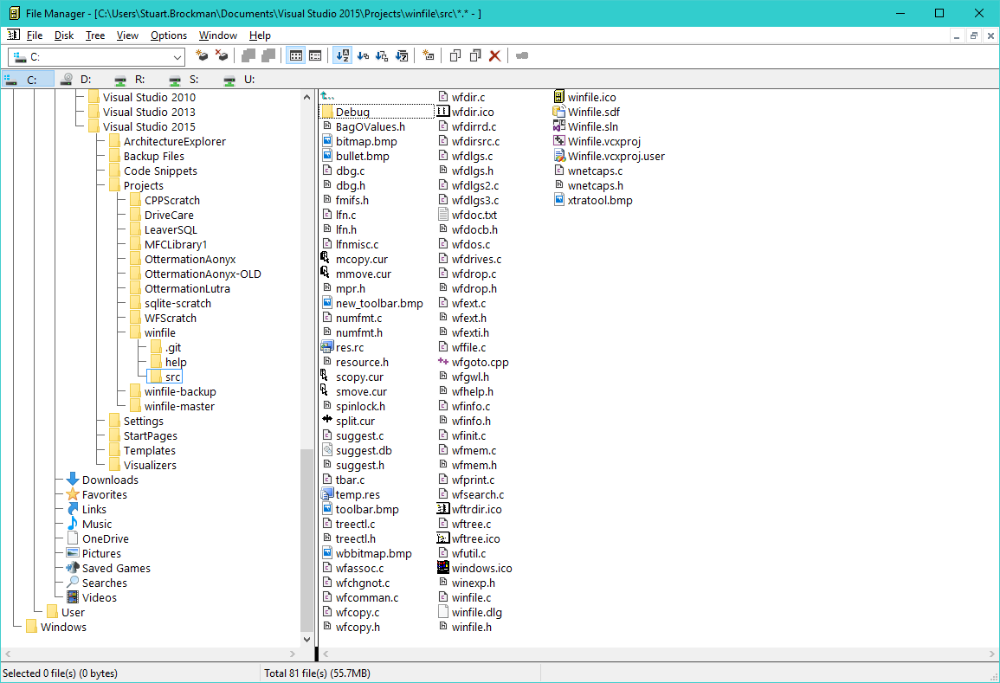

#  Windows File Manager (WinFile) With "Modernised" Windows UI

Based on the Microsoft source code released at https://github.com/Microsoft/winfile.

Enhanced with more modern Windows user interface:

1. "Visual styles" enabled.
2. Newer "flat" toolbar style applied.
3. "Drive selection line" modified to use toolbar styling.
4. "Correct" file/folder/drive icons taken from Shell API.
5. New high-colour toolbar icons based on icons from the Visual Studio Image Library.

## History

The Windows File manager was originally released with Windows 3.0 in the early 1990s.  You
can read more about the history at https://en.wikipedia.org/wiki/File_Manager_(Windows).

## What it looks like

## License

Original source Copyright (c) Microsoft Corporation. All rights reserved.
Updates and additions Copyright (c) Stuart Brockman.

Licensed under the [MIT](LICENSE) License.
